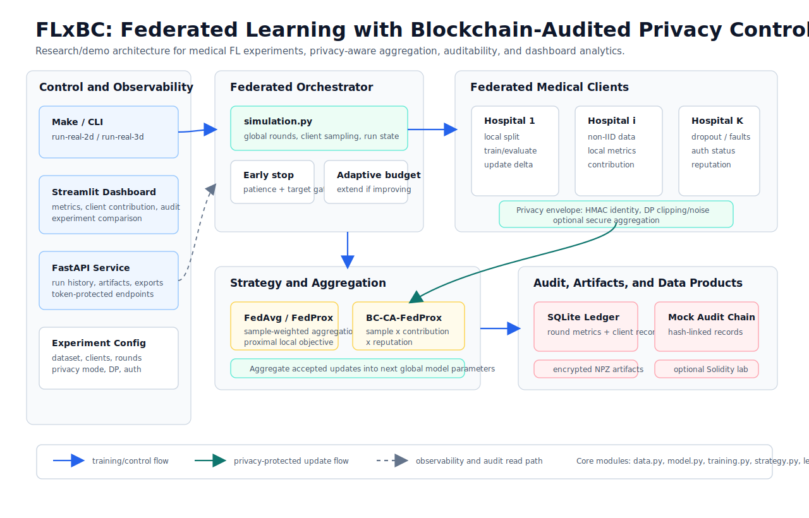
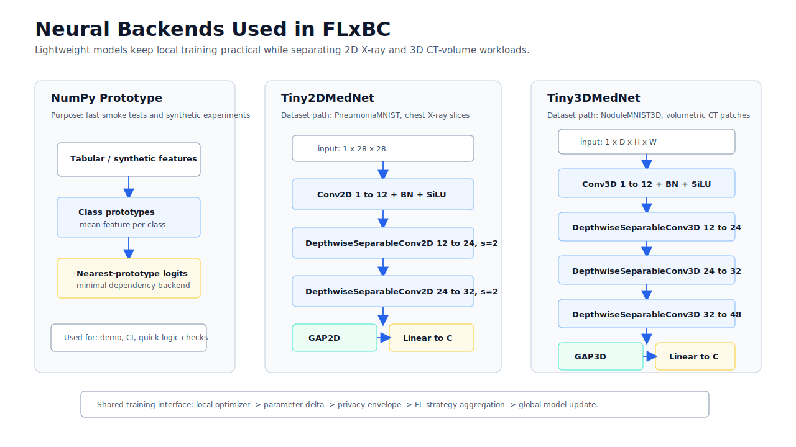
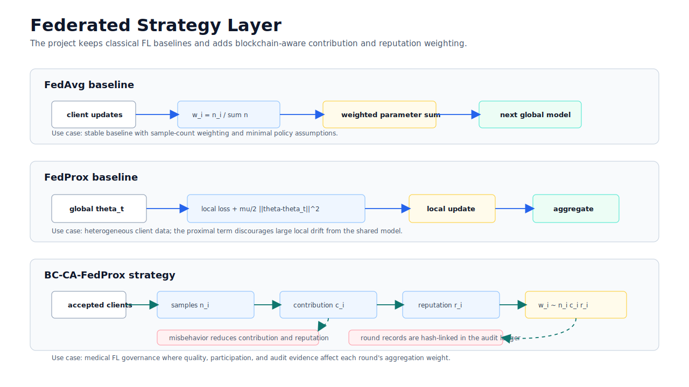

# FLxBC

区块链审计联邦学习 — 本地演示系统。模拟多家医院协同训练 AI 模型，用区块链记录审计痕迹。

## 快速开始

```bash
make setup       # 安装依赖
make run         # 合成数据演示（最多 50 轮 / early stopping / 5 家医院）→ 自动打开 Dashboard
```

用真实医学影像：

```bash
make run-real-2d    # PneumoniaMNIST 胸部 X 光 + PyTorch CNN → 自动打开 Dashboard
make run-real-3d    # NoduleMNIST3D 肺结节 CT + PyTorch 3D CNN → 自动打开 Dashboard
```

## 命令一览

### 一键运行

| 命令           | 数据             | 后端         | 说明               |
|----------------|------------------|--------------|--------------------|
| `make run`     | 合成假数据       | NumPy        | 最多 50 轮，验证集 early stopping |
| `make run-real`| PneumoniaMNIST   | PyTorch CNN  | `run-real-2d` 的兼容别名 |
| `make run-real-2d`| PneumoniaMNIST | PyTorch CNN | 初始 50 轮，可自适应扩展到 200 轮 |
| `make run-real-3d`| NoduleMNIST3D | PyTorch 3D CNN | 初始 40 轮，可自适应扩展到 120 轮 |

真实数据命令会：跑仿真 → 跑中心化对比 → 打开 Dashboard 展示结果。训练先给一个初始轮次预算；如果到达预算时尚未满足停止条件，会按上限自动扩展。按 `Ctrl+C` 停止 Dashboard。

### 自定义参数

`make run` / `make run-real-*` 默认启用 early stopping。可通过 Make 变量调初始轮次、样本量、扩展上限和目标指标：

```bash
make run DEMO_ROUNDS=80 SYNTHETIC_TARGET_ARGS="--target-accuracy 0.9"
make run-real-2d REAL_ROUNDS=80 REAL_MAX_TRAIN_SAMPLES=4000 REAL_MAX_TEST_SAMPLES=600
make run-real-2d REAL_TARGET_ARGS="--target-accuracy 0.9 --target-macro-f1 0.85"
make run-real-3d NODULE_ROUNDS=60 NODULE_MAX_TRAIN_SAMPLES=1200 NODULE_MAX_TEST_SAMPLES=300
```

要调医院数、策略、数据集等，直接用底层命令：

```bash
# 通用格式
uv run --extra app --extra ml flxbc run [选项] --db data/flxbc.db
```

```bash
# 15 轮 / 8 家医院 / FedAvg 策略
flxbc run --dataset pneumoniamnist --rounds 15 --clients 8 --strategy fedavg --db data/flxbc.db

# 3D 肺结节 CT 数据集
flxbc run --dataset nodulemnist3d --rounds 10 --clients 6 --db data/flxbc.db

# IID 数据 + 不模拟故障
flxbc run --synthetic --rounds 10 --clients 5 --iid --no-failures --db data/flxbc.db

# 只跑仿真，不开 Dashboard
flxbc run --synthetic --rounds 5 --clients 3 --no-dashboard --db data/flxbc.db

# 允许系统按验证集 loss 自动停止，并在 dashboard 中显示最佳轮次
flxbc run --synthetic --rounds 50 --clients 5 --early-stopping \
  --early-stopping-monitor val_loss --early-stopping-patience 5 \
  --early-stopping-min-delta 0.001 --target-accuracy 0.85 --target-loss 0.35 \
  --no-dashboard --db data/flxbc.db
```

> 用合成数据时去掉 `--extra ml`，命令更短：`uv run --extra app flxbc run --synthetic ...`

### 参数说明

| 参数              | 默认值            | 说明                                               |
|-------------------|-------------------|----------------------------------------------------|
| `--rounds`        | 10                | federated rounds                                   |
| `--clients`       | 5                 | simulated hospitals                                |
| `--strategy`      | `bc-ca-fedprox`   | fedavg / fedprox / bc-ca-fedprox                   |
| `--dataset`       | `nodulemnist3d`   | pneumoniamnist / nodulemnist3d                     |
| `--synthetic`     | off               | synthetic data (no ML deps needed)                 |
| `--iid`           | off               | IID split (default: non-IID Dirichlet)             |
| `--no-failures`   | off               | skip dropout / timeout / malicious simulation      |
| `--device`        | `auto`            | auto / cpu / mps / numpy                           |
| `--no-dashboard`  | off               | simulation only, no Dashboard                      |
| `--early-stopping`| off               | enable validation-driven stopping                  |
| `--early-stopping-monitor` | `val_loss` | metric used by early stopping                     |
| `--early-stopping-mode` | `min`        | `min` for loss, `max` for accuracy/F1              |
| `--early-stopping-patience` | 5        | rounds without meaningful improvement before stop  |
| `--early-stopping-min-delta` | 0.0     | minimum improvement counted as progress            |
| `--min-rounds`    | 1                 | warm-up rounds before stopping is allowed          |
| `--target-accuracy` | unset           | stop when validation accuracy reaches target       |
| `--target-macro-f1` | unset           | stop when validation Macro-F1 reaches target       |
| `--target-loss` | unset               | stop when validation loss reaches target or lower  |
| `--adaptive-rounds` | off             | extend round budget when max round is reached before stopping |
| `--round-extension` | 20              | rounds added per adaptive extension                |
| `--max-rounds-cap` | 200              | hard cap for adaptive extensions                   |
| `--privacy-mode`  | `none`            | none / dp / encrypted / secure-aggregation / full-demo |
| `--client-auth`   | `none`            | optional demo HMAC validation for client updates   |
| `--artifact-encryption` | off         | encrypt model artifacts with AES-GCM               |
| `--secure-aggregation` | off          | enable demo secure aggregation when possible       |
| `--dp-noise-multiplier` | 0.0         | DP Gaussian noise multiplier                       |
| `--clipping-norm` | 1.0               | update clipping norm for DP/privacy modes          |

## 训练指标与自动停止

Dashboard 的“训练过程”页现在拆分展示：

- 质量指标：test/validation accuracy、Macro-F1。主图突出显示 test accuracy 和 test Macro-F1。
- Loss：train/validation/test loss。
- 泛化差距：`val_loss - train_loss` 与 `train_accuracy - val_accuracy`。
- 系统与隐私指标：参与节点数、accepted/rejected client、update norm。
- 通信成本：download/upload bytes、每轮通信量、累计通信量。
- 耗时：每轮总耗时、本地训练、聚合、评估耗时。
- 客户端差异：per-client accuracy/loss mean/std，用于观察数据异质性和 client drift。

兼容旧数据的 `accuracy`、`macro_f1`、`loss`、`auc` 别名继续指向 test 指标。AUC 仍会记录在明细表和 metrics 中，用于二分类阈值无关的排序能力诊断，但不再放进主质量曲线，避免淹没 accuracy/F1。新训练会在 `summary.json` 中同时写入 `final_metrics` 和 `best_metrics`，早停时应优先参考 `best_round` 对应的模型 artifact。若设置了目标指标，还会记录 `time_to_target_round`、`time_to_target_seconds` 和 `communication_bytes_at_target`。

`make run-real-2d` 默认不再用单一 `target_accuracy` 作为停止条件。PneumoniaMNIST 是类别不均衡二分类任务，小验证集 accuracy 容易过早达标；真实数据入口默认改为至少 10 轮 warm-up，再按 `val_loss` 的 patience 判断是否停止。如果到达初始轮次时仍未停止，会自动扩展轮次预算。需要硬性目标时再显式传 `REAL_TARGET_ARGS`，建议同时设置 accuracy 和 Macro-F1。

## 隐私增强演示

默认运行仍是本地演示模式，不声称生产级隐私。需要演示隐私增强链路时，可启用 DP、HMAC、artifact 加密和 secure aggregation demo：

```bash
export FLXBC_ARTIFACT_KEY="$(uv run python -c 'import base64, os; print(base64.urlsafe_b64encode(os.urandom(32)).decode())')"

flxbc run --synthetic --rounds 10 --clients 5 --privacy-mode full-demo \
  --client-auth hmac-demo --artifact-encryption --secure-aggregation \
  --dp-noise-multiplier 0.25 --clipping-norm 0.75 \
  --no-dashboard --db data/flxbc.db
```

### 其他命令

```bash
# 开发
make test         # 跑测试
make lint         # 代码检查

# 独立启动
make dashboard    # 只启动 Dashboard（http://127.0.0.1:8501）
make api          # 只启动 API（http://127.0.0.1:8000/docs）

# 区块链（可选）
nvm use && make setup-chain && make chain && make deploy-chain

# 清理
make clean        # 删除 artifacts、数据库、缓存
```

## 架构



上图概括了当前系统主链路：`Make / CLI` 发起实验，`simulation.py` 负责编排联邦轮次、客户端采样、自适应轮次和早停判断；各医疗节点只在本地训练并上报更新；隐私控制层覆盖 HMAC 节点身份、DP 裁剪/噪声、可选安全聚合；聚合后的全局模型、指标、客户端贡献、审计哈希链和加密 artifact 进入本地账本与 Dashboard/API。

### 神经网络后端



`NumPy Prototype` 用于快速 demo/CI；`Tiny2DMedNet` 面向 PneumoniaMNIST 这类 2D X-ray 数据；`Tiny3DMedNet` 面向 NoduleMNIST3D 这类 3D CT patch 数据。三者共用训练接口，最终都输出参数更新供联邦策略聚合。

### 联邦策略



策略层保留 `FedAvg` 和 `FedProx` 作为基线，同时实现 `BC-CA-FedProx`：聚合权重由样本量、贡献度和信誉共同决定，异常或低质量客户端会被降低贡献/信誉，并把轮次指标与审计记录写入账本。

## 说明

本项目为研究/演示系统，不处理真实患者数据，不用于临床。审计链默认为本地 Mock 链（SQLite 内模拟区块哈希链接与完整性校验），可选接入 Hardhat 本地链做智能合约实验。
